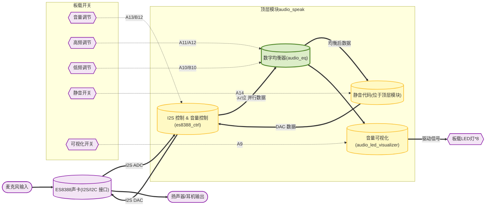
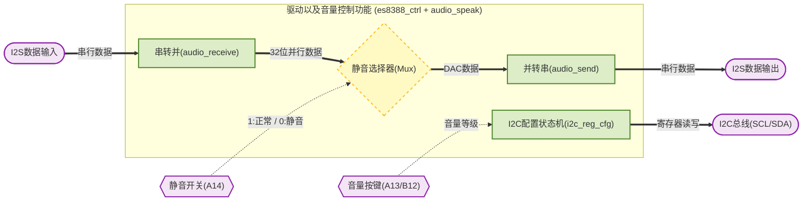
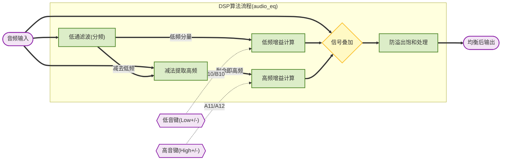

# 简介

这是一个基于安路FPGA开发板EG4SBG256开发板+ES8388音频编解码器的驱动程序。该驱动程序实现了通过I2S接口与ES8388芯片进行通信，以实现音频数据的采集和播放功能。

## 系统架构图

```mermaid
graph LR
    %% ================= 样式定义 =================
    %% 紫色系：外部硬件
    classDef purple fill:#f3e5f5,stroke:#8e24aa,stroke-width:2px,rx:5,ry:5;
    %% 黄色系：FPGA 接口与逻辑
    classDef logic fill:#fff9c4,stroke:#fbc02d,stroke-width:2px,rx:5,ry:5;
    %% 绿色系：FPGA 核心算法
    classDef core fill:#dcedc8,stroke:#558b2f,stroke-width:3px,rx:10,ry:10;

    %% ================= 外部独立设备 =================
    Mic(["麦克风输入"]):::purple
    Codec[("ES8388声卡(I2S/I2C 接口)")]:::purple
    Speaker(["扬声器/耳机输出"]):::purple
    %% 修改：LED改为六边形
    LEDs{{"板载LED灯*8"}}:::purple

    %% ================= 开关控制面板 (成组) =================
    subgraph Controls ["板载开关"]
        direction TB
        SwVol{{"音量调节"}}:::purple
        SwTreble{{"高频调节"}}:::purple
        SwBass{{"低频调节"}}:::purple
        SwMute{{"静音开关"}}:::purple
        SwVis{{"可视化开关"}}:::purple
    end

    %% ================= FPGA 系统 =================
    subgraph FPGA ["顶层模块audio_speak"]
        direction LR
        Ctrl[("I2S 控制 & 音量控制(es8388_ctrl)")]:::logic
        EQ[("数字均衡器(audio_eq)")]:::core
        Mute[("静音代码(位于顶层模块)")]:::logic
        Vis[("音量可视化(audio_led_visualizer)")]:::logic
    end

    %% ================= 连线逻辑 =================
    
    %% 1. 音频主链路
    Mic ==> Codec
    Codec ==> |"I2S ADC"| Ctrl
    Ctrl ==> |"32位 并行数据"| EQ
    EQ ==> |"均衡后数据"| Mute
    Mute ==> |"DAC 数据"| Ctrl
    Ctrl ==> |"I2S DAC"| Codec
    Codec ==> Speaker

    %% 2. 视觉链路
    EQ ==> Vis
    Vis ==> |"驱动信号"| LEDs

    %% 3. 控制信号链路 (从控制面板接入)
    SwVol -.-> |"A13/B12"| Ctrl
    SwTreble -.-> |"A11/A12"| EQ
    SwBass -.-> |"A10/B10"| EQ
    SwMute -.-> |"A14"| Mute
    SwVis -.-> |"A9"| Vis
```

```mermaid
graph LR
    %% 样式定义 (保持一致)
    classDef purple fill:#f3e5f5,stroke:#8e24aa,stroke-width:2px,rx:5,ry:5;
    classDef algo fill:#dcedc8,stroke:#558b2f,stroke-width:2px,rx:0,ry:0;
    classDef logic fill:#fff9c4,stroke:#fbc02d,stroke-width:2px,rx:0,ry:0;

    %% 外部接口
    I2S_In(["I2S数据输入"]):::purple
    I2S_Out(["I2S数据输出"]):::purple
    I2C_Bus(["I2C总线(SCL/SDA)"]):::purple
    
    %% 开关组
    Sw_Mute{{"静音开关(A14)"}}:::purple
    Sw_Vol{{"音量按键(A13/B12)"}}:::purple


    %% 内部逻辑
    subgraph Ctrl_Logic ["驱动以及音量控制功能 (es8388_ctrl + audio_speak)"]
        direction TB
        
        %% 数据通路
        RX["串转并(audio_receive)"]:::algo
        TX["并转串(audio_send)"]:::algo
        Mux{"静音选择器(Mux)"}:::logic
        
        %% 控制通路
        CFG["I2C配置状态机(i2c_reg_cfg)"]:::algo
    end

    %% 连线关系
    %% 1. 音频数据流 (Data Path)
    I2S_In ==> |"串行数据"| RX
    RX ==> |"32位并行数据"| Mux
    Mux ==> |"DAC数据"| TX
    TX ==> |"串行数据"| I2S_Out

    %% 2. 静音控制
    Sw_Mute -.-> |"1:正常 / 0:静音"| Mux

    %% 3. 硬件配置流 (Config Path)
    Sw_Vol -.-> |"音量等级"| CFG
    CFG ==> |"寄存器读写"| I2C_Bus
    
    %% 细节标注 (静音逻辑是纯组合逻辑)
    style Mux stroke-dasharray: 5 5
```

```mermaid
graph LR
    %% 样式定义
    classDef purple fill:#f3e5f5,stroke:#8e24aa,stroke-width:2px,rx:5,ry:5;
    classDef algo fill:#dcedc8,stroke:#558b2f,stroke-width:2px,rx:0,ry:0;
    classDef logic fill:#fff9c4,stroke:#fbc02d,stroke-width:2px,rx:0,ry:0;

    %% 输入输出
    Audio_In(["音频输入"]):::purple
    Sw_Vis{{"可视化开关(A9)"}}:::purple
    LEDs(["LED*8输出"]):::purple

    %% 处理逻辑
    subgraph Vis_Logic ["可视化处理 (audio_led_visualizer)"]
        direction TB
        
        %% 模式选择
        Mode{"模式选择"}:::logic
        
        %% 路径A：频谱显示
        Abs["取绝对值"]:::algo
        Envelope["包络检波"]:::algo
        Mapping["阈值量化映射"]:::algo
        
        %% 路径B：待机动画
        Anim["待机动画生成(弹跳小球算法)"]:::algo
        
    end

    %% 连线
    Audio_In ==> Abs
    Abs ==> Envelope
    Envelope ==> Mapping
    
    Mapping ==> Mode
    Anim ==> Mode
    
    Sw_Vis -.-> |"1: 频谱模式 / 0: 待机动画"| Mode
    Mode ==> LEDs
    
    %% 细节标注
    style Envelope stroke-dasharray: 5 5
```

```mermaid
graph LR
    %% 样式定义 (保持一致)
    classDef purple fill:#f3e5f5,stroke:#8e24aa,stroke-width:2px,rx:5,ry:5;
    classDef algo fill:#dcedc8,stroke:#558b2f,stroke-width:2px,rx:0,ry:0;
    classDef logic fill:#fff9c4,stroke:#fbc02d,stroke-width:2px,rx:0,ry:0;

    %% 输入输出
    Audio_In(["音频输入"]):::purple
    Audio_Out(["均衡后输出"]):::purple
    
    %% 开关组
    Sw_Bass{{"低音键(Low+/-)"}}:::purple
    Sw_Treble{{"高音键(High+/-)"}}:::purple

    %% 算法流程
    subgraph DSP_Logic ["DSP算法流程(audio_eq)"]
        direction TB
        
        %% 核心运算单元
        LPF["低通滤波(分频)"]:::algo
        Sub["减法提取高频"]:::algo
        
        Calc_Bass["低频增益计算"]:::algo
        Calc_Treble["高频增益计算"]:::algo
        
        Sum{"信号叠加"}:::logic
        Sat["防溢出饱和处理"]:::algo
    end

    %% 连线关系
    %% 1. 分频逻辑
    Audio_In ==> LPF
    Audio_In ==> Sub
    LPF ==> |"低频分量"| Calc_Bass
    LPF ==> |"减去低频"| Sub
    Sub ==> |"剩余即高频"| Calc_Treble

    %% 2. 增益控制
    Sw_Bass -.-> |"A10/B10"| Calc_Bass
    Sw_Treble -.-> |"A11/A12"| Calc_Treble

    %% 3. 混合输出
    Audio_In ==> Sum
    Calc_Bass ==> Sum
    Calc_Treble ==> Sum
    
    Sum ==> Sat
    Sat ==> Audio_Out
```