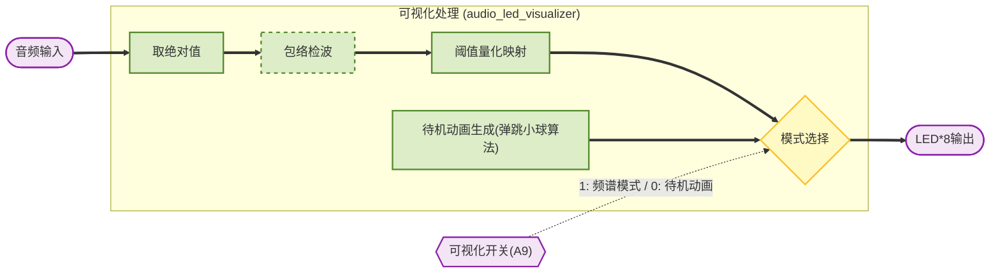

# 简介

这是一个基于安路FPGA开发板EG4SBG256开发板+ES8388音频编解码器的驱动程序。该驱动程序实现了通过I2S接口与ES8388芯片进行通信，以实现音频数据的采集和播放功能。

## 主要特性
- 支持 ES8388 音频编解码器，通过 I2S 完成音频数据收发，通过 I2C 进行寄存器配置。
- 支持音量控制、静音、数字均衡（EQ）与 LED 可视化显示模块。
- 面向安路 FPGA（EG4SBG256）开发板，示例引脚映射与演示工程一起提供。
- 可扩展：方便替换 DSP 算法或增加滤波/效果模块。

## 设计目标
- 实现稳定的录放通路（I2S RX/TX），并把音量与 EQ 控制放在 FPGA 可配置逻辑中。
- 使用 I2C 在系统启动和运行期间配置 ES8388 寄存器。
- 提供可视化驱动，为教学与调试提供直观反馈。

## 硬件接线（示例）
注意：下表为示例映射，具体引脚请以开发板原理图/管脚表为准。
- ES8388 -> FPGA（示例）
  - I2C SDA  -> FPGA SDA（检查板上定义）
  - I2C SCL  -> FPGA SCL
  - I2S BCLK -> FPGA BCLK（Bit Clock）
  - I2S LRCK -> FPGA LRCK（Word Select）
  - I2S SDIN -> FPGA SDIN（从 Codec 到 FPGA 的数据 / ADC）
  - I2S SDOUT-> FPGA SDOUT（从 FPGA 到 Codec 的数据 / DAC）
  - 电源与地：请确保 3.3V/芯片电源和地连接正确，注意模拟地与数字地的布线建议。

- 开发板按键 / 指示
  - 音量按键：示例 A13 / B12（可映射为两路按键或编码器）
  - 低音/高音调节：示例 A10/B10 / A11/A12
  - 静音开关：示例 A14
  - LED 可视化开关：示例 A9
  - 板载 LED：8 灯，用于频谱/动画显示

## 构建与部署（通用步骤）
1. 准备 FPGA 工具链（根据你的工作流：Anlogic 官方工具或开源流程）。  
2. 打开工程，调整约束文件（pin constraints）以匹配你的板子引脚。  
3. 运行综合（Synthesis）-> 实现（Implementation）-> 生成 Bitstream。  
4. 使用板载或外部下载工具将 bitstream 写入目标开发板。  
5. 给 ES8388 上电，FPGA 启动后通过 I2C 配置芯片寄存器（见下节）。  
6. 使用示例测试程序或外设（麦克风/扬声器）验证录放功能与 LED 可视化。

## 配置与寄存器（说明）
- 强烈建议参考 ES8388 Datasheet 获取完整寄存器地图和寄存器含义。  
- 常见启动流程（伪代码/示例）：
  - 复位 Codec（写寄存器 soft reset）
  - 配置 A/D、D/A 数据格式（I2S 左/右对齐、位宽 16/24/32）
  - 配置采样率及时钟分频
  - 设置初始音量值并取消静音
- 示例（仅作说明，具体寄存器编号以 datasheet 为准）：
  - 写入寄存器 0x00 = 0x00 // 软件复位（示例）
  - 写入音量寄存器（示例）...

## 测试用例与验证
- 回环测试：播放已知正弦波或方波，采样并检查 FFT/时域波形是否匹配。  
- 麦克风采集：通过 ADC 抓取音频并在 PC 上用工具（如 Audacity）或示波器查看。  
- 输出验证：逐步调节音量与静音开关，验证 I2C 配置命令是否生效（观察声音与 LED 反馈）。

## 故障排查（快速清单）
- 无 I2C 响应：检查 SDA / SCL 连线、上拉电阻、和电源。  
- 无 I2S 时钟（BCLK/LRCK）：确认 FPGA 输出时钟是否已配置并稳定。  
- 无音频输出或输入电平低：检查 ADC/DAC 增益与音量寄存器设置，确保未静音。  
- 串并转换错误（错位/噪声）：检查数据位宽、时钟相位（I2S 对齐）与时序。  
- LED 可视化不变：确认可视化开关信号是否接入，以及 EQ/Envelope 输出有无合理幅度。

## 常见命令/调试工具建议
- I2C 扫描工具：用于确认 Codec 地址是否存在并可响应。  
- 示波器/逻辑分析仪：观测 BCLK/LRCK/SDIN/SDOUT 时序。  
- 音频工具（PC 端）：录放验证音质、时延与失真。

## 致谢
- 感谢 ES8388 方案与安路 FPGA 提供的硬件平台与资料参考。  
- 若使用第三方参考代码或算法，请在相应文件中注明来源并遵循原作者许可。

## 系统架构图

